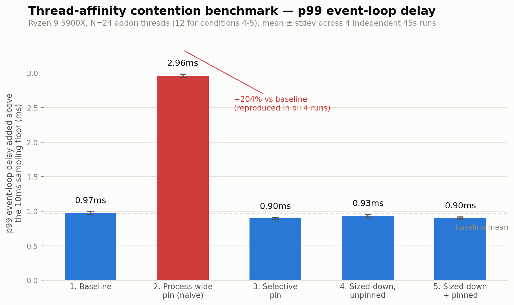
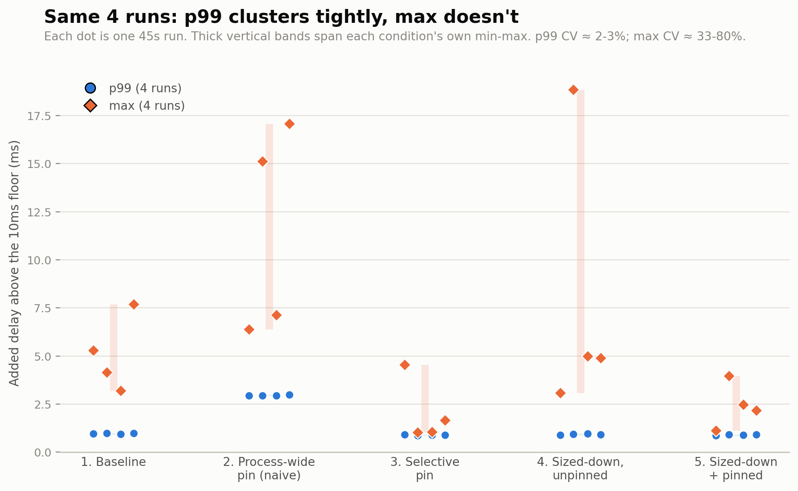

# Thread affinity contention benchmark

**TL;DR:** A synthetic Node.js benchmark isolating what CPU affinity actually buys you when libuv's threadpool contends with a separately-threaded native addon in the same process. Ryzen 9 5900X, run 4 independent times. Naively `taskset -p`'ing the whole process onto one CPU set -- the only option today -- roughly triples p99 event-loop delay, reproduced in all 4 runs. Selective per-thread pinning and just sizing the addon's pool to its own cores each help too, but modestly (4-8%). Full numbers, methodology, and why `max` isn't trustworthy at this sample size are further down in "Real hardware this was run on."

Evidence-gathering benchmark for two proposed Node.js/libuv env vars:
`UV_THREADPOOL_AFFINITY` (libuv/libuv) and `NODE_MAIN_THREAD_AFFINITY`
(nodejs/node). Both would let Node pin its own threads (the event loop /
main thread, and the libuv threadpool used for crypto/dns/fs work) to a
reserved set of CPUs, separate from whatever CPUs a CPU-heavy native addon's
own thread pool uses.

This directory does **not** implement that feature. It's a black-box
approximation via `taskset -p` on a running process, built to answer the
question a skeptical reviewer will ask first: does keeping Node's threads
and a contending native addon's threads on separate cores actually help,
and is that different from just telling the addon to use fewer threads?

## Why this is a cache-domain test, not a NUMA test

The target machine (a Ryzen 9 5900X: 12 cores / 24 threads across two CCDs,
6 cores each) is a single NUMA node under Linux — there's no NUMA boundary
to pin around here. What _does_ exist is two separate 32MB L3 caches, one
per CCD, not shared with each other. So "Node set" and "addon set" in this
benchmark are the two CPU groups that share an L3 domain, discovered at
runtime from `/sys/devices/system/cpu/cpu*/cache/index3/shared_cpu_list` —
never hardcoded CPU numbers. Putting Node's threads and the addon's threads
in different L3 groups means they're on physically separate caches, not
just separate cores sharing one contended cache.

This connects directly to the oneDNN global-primitive-cache contention
already diagnosed in [Isidorus](../isidorus) as the root cause of its p99
latency spikes at higher concurrency: a native addon's own thread pool
fighting Node's threads for the same L3 domain is the same mechanism this
benchmark isolates, just externally controlled via `taskset` instead of
happening incidentally.

If a run reports a topology with anything other than exactly two L3 groups
(e.g. a different CPU, or a machine with a real NUMA split), the harness
fails loudly with the discovered groups printed rather than guessing how to
proceed. See `lib/topology.js`.

## Layout

```
contention-addon/     Synthetic CPU-heavy native addon (node-addon-api / C++)
  src/addon.cpp
  binding.gyp
  test.js             Standalone build/load smoke test
lib/
  topology.js          L3-group discovery, CPU-list <-> taskset mask helpers
  procfs.js             /proc/<pid>/task enumeration, taskset apply + verify
  worker-child.js       The measured Node process for one condition
benchmark-harness.js   Orchestrator: runs all 5 conditions, prints + writes results
results/               Output JSON/Markdown from each run (gitignored)
```

## Building

```
cd contention-addon
npm install
npm run build      # node-gyp rebuild
npm run selftest   # node test.js -- confirms it builds, loads, spawns N named threads, start()/stop() work
```

If `node-gyp` can't reach `nodejs.org` to download headers (e.g. a
network-restricted sandbox), point it at an already-installed Node's headers
instead: `node-gyp rebuild --nodedir=/path/to/node/install`. On a normal
desktop this shouldn't be necessary.

**A real gotcha, already worked around in this code, worth knowing if you
modify it:** once `contention-addon` is `require()`'d, calling
`process.exit()` anywhere in that process hangs forever on Node 22 instead
of exiting — the N-API environment cleanup hook that joins the addon's
pthreads doesn't get invoked by the explicit-exit path the way it does on a
natural exit. `test.js` and `lib/worker-child.js` both avoid this by setting
`process.exitCode` and letting the script return / the event loop drain
naturally instead of calling `process.exit()`. If you add new exit paths,
keep doing that. (Verified directly: with `process.exit(0)` the process
hangs past a 10s timeout with no cleanup-hook output at all; replacing it
with `process.exitCode` + natural return exits cleanly and immediately with
the cleanup hook running as expected.)

## Running

```
node benchmark-harness.js [--duration-ms=45000] [--cooldown-ms=3000] \
                           [--pbkdf2-concurrency=8] [--pbkdf2-iterations=100000] \
                           [--out-dir=results]
```

Needs `taskset` (`util-linux`) on PATH, and reads `/proc` and
`/sys/devices/system/cpu`, so it only runs on Linux — it checks
`process.platform` first and stops with a message on anything else. It does
not need root; `taskset -p` on your own process's threads doesn't require
elevated privileges.

Each of the five conditions runs in a fresh child Node process
(`lib/worker-child.js`), so conditions never contend with each other's
leftover state:

1. **Baseline** — no `taskset` at all, addon spawns one thread per logical
   CPU (24 on the target machine).
2. **Process-wide pin** — every thread the child process has (main, libuv
   threadpool, V8 background threads, _and_ the addon's threads) gets
   `taskset -p`'d to the Node-set mask alone. This is what someone
   naively "pinning the whole Node process" would end up doing if they
   applied the same mask process-wide instead of splitting it — it's
   expected to hurt, since it now crams the addon's 24 threads onto just
   the Node set's 12 CPUs alongside Node's own threads, rather than
   isolating anything.
3. **Selective per-thread pin** — the actual proposal, approximated from
   outside the process: main thread + libuv threadpool (+ any other
   non-addon thread) get the Node-set mask; `bench-worker-*` addon threads
   get the addon-set mask.
4. **Sized-down, unpinned** — no pinning, but the addon only spawns as many
   threads as the addon set has CPUs (12), leaving the rest free for Node's
   threads to float onto. The "just cap the addon's thread pool instead"
   alternative — the first thing a skeptical maintainer will ask about.
5. **Sized-down, selectively pinned** — same addon thread count as
   condition 4, plus the selective pinning from condition 3. Since thread
   counts match condition 4, the 4-vs-5 delta isolates the effect of
   _placement_ from the effect of _sizing_.

Sequencing per condition (see `runCondition` in `benchmark-harness.js` and
`main()` in `lib/worker-child.js`): the child process loads the addon
(spawning its threads, named but idle) and warms up the libuv threadpool
(forcing its worker threads into existence too — they're otherwise created
lazily on first use, which would be _after_ pinning if not forced early),
then signals readiness over IPC. The harness enumerates
`/proc/<pid>/task`, applies the condition's `taskset -p` calls, and
verifies every pinned thread's `Cpus_allowed_list` actually matches before
telling the child to begin. "Begin" starts the addon's busy loop, starts 8
(configurable) concurrent `crypto.pbkdf2` chains on the libuv threadpool,
and enables `perf_hooks.monitorEventLoopDelay()` — all at once, for the
configured duration (default 45s). The child reports p50/p95/p99/max event
loop delay back over IPC and exits.

### Reading the output

The harness prints a table, the same table as a Markdown block ready to
paste into the GitHub issues, and three comparisons:

- **3 vs 1** — the headline: does selective pinning help under full
  contention.
- **4 vs 1** — how much plain sizing-down recovers on its own.
- **5 vs 4** — whether pinning adds anything once sizing is already done.

If 4 comes out close to 5, that's a real result too: it means pinning's
marginal value over just capping the addon's thread count is small, and the
issues should say so rather than the numbers getting iterated on until they
look better. Full JSON + Markdown per run land in `results/`.

## Real hardware this was run on

Ryzen 9 5900X (12C/24T, dual CCD), Linux, Node v20.20.2. Topology discovery
found exactly 2 L3 groups covering all 24 logical CPUs, as expected:

- Node set: `[0,1,2,3,4,5,12,13,14,15,16,17]` (12 CPUs)
- Addon set: `[6,7,8,9,10,11,18,19,20,21,22,23]` (12 CPUs)

Run parameters: 45s per condition, 8 concurrent `crypto.pbkdf2` calls
(100,000 iterations each), 3s cooldown between conditions. Run **four
times** end-to-end (run 1 had Chrome open in the background during
condition 1; runs 2-4 were clean, back to back), specifically to find out
whether single-run numbers were representative or noise.

Event loop delay was measured with `monitorEventLoopDelay({resolution: 10})`,
which samples every 10ms; raw histogram values are dominated by that 10ms
floor, so delay _added above_ that floor (raw minus 10ms) is what's
compared below — that's where the actual signal is.

`p50Ms` is exactly `10.06` in all 5 conditions across all 4 runs (20/20
data points, zero variance) and is left out of the tables below for that
reason. It's tempting to read that as pbkdf2's own compute time (100,000
iterations does cost a few ms of CPU), but that can't be it: if p50 were
tracking work done on the threadpool, it would shift under contention the
way p99 does — and condition 2 nearly triples p99 relative to baseline
while p50 doesn't move by even 0.01ms. A number that's identical to two
decimal places regardless of how contended the machine is isn't workload
signal, it's `resolution: 10`'s own floor. That's also why this benchmark
reports p95/p99/max (as delay _added_ above the floor) and not p50 at all.

**p99 added delay across all 4 runs (mean ± population stdev, range):**

| Condition                         | Mean   | Stdev   | Range       | vs baseline          |
| --------------------------------- | ------ | ------- | ----------- | -------------------- |
| 1. Baseline                       | 0.97ms | ±0.02ms | 0.94-0.99ms | —                    |
| 2. Process-wide pin (naive)       | 2.96ms | ±0.03ms | 2.94-3.00ms | +204%                |
| 3. Selective per-thread pin       | 0.90ms | ±0.02ms | 0.88-0.92ms | -8%                  |
| 4. Sized-down, unpinned           | 0.93ms | ±0.02ms | 0.90-0.96ms | -4%                  |
| 5. Sized-down, selectively pinned | 0.90ms | ±0.02ms | 0.88-0.92ms | -7% (-3% vs cond. 4) |



At n=4, p99 is tight: every condition's stdev is around 0.02-0.03ms against
means of roughly 1-3ms, a coefficient of variation around 2-3%. That's what
makes condition 2 vs 1 the strongest claim this benchmark supports: naively
`taskset -p`'ing the whole process onto the Node set (while the addon still
spawns 24 threads) roughly _triples_ p99 added delay, and it did so in all
four independent runs with barely any spread (2.94, 2.95, 2.94, 3.00ms).
Real evidence for the "why process-level affinity isn't sufficient"
argument in both proposals, not just reasoning about it.

Selective pinning (3 vs 1) and sizing down alone (4 vs 1) land in the same
modest 4-8% range, consistently — on this workload and machine, a
meaningful part of pinning's benefit is attributable to giving Node's
threads room to run at all, not to placement specifically. That's the
objection a skeptical reviewer raises first, and it holds up under
repetition. Condition 5 vs 4, thread count held constant, moves p99 by
only about 3% — pinning on top of sizing doesn't add much at this
percentile.

**max is a different story, and repetition is what exposed it:**

| Condition                         | Mean    | Stdev   | CV  | Range        |
| --------------------------------- | ------- | ------- | --- | ------------ |
| 1. Baseline                       | 5.09ms  | ±1.67ms | 33% | 3.21-7.69ms  |
| 2. Process-wide pin               | 11.43ms | ±4.72ms | 41% | 6.40-17.08ms |
| 3. Selective per-thread pin       | 2.08ms  | ±1.46ms | 70% | 1.03-4.56ms  |
| 4. Sized-down, unpinned           | 7.96ms  | ±6.34ms | 80% | 3.08-18.85ms |
| 5. Sized-down, selectively pinned | 2.44ms  | ±1.02ms | 42% | 1.12-3.98ms  |



Coefficients of variation of 33-80% on `max`, versus 2-3% on `p99` from the
same four runs, is about as direct as evidence gets that a single-run
`max` isn't a number worth building an argument on. Condition 4 alone
ranged from 3.08ms to 18.85ms added delay across identical runs — a 6x
spread with nothing about the condition changing. **p95/p99 are the
metrics this benchmark supports; `max` isn't, at least not without many
more repeated trials per condition than four.** On the _mean_ across all
four runs, conditions 3 and 5 (both involving selective pinning) do have
the lowest average max and the tightest condition-2-vs-others gap is
directionally consistent with the p99 story, but with CVs this high that
should be read as a hint, not a finding.

**Net:** pinning helps, reproducibly, at p99, but modestly (4-8%), and a
comparable chunk of that comes from sizing the addon's pool down rather
than from placement. The dramatic-looking effect is process-wide pinning
being bad, not selective pinning being great. That's a smaller and more
qualified result than the motivation sections of either proposal might
imply on their own, and it's reported here as measured across four
independent runs rather than as whichever single run looked best. Full
JSON for all four runs is in `results/results-5900x-run1.json` through
`run4.json`.

## Validating against a real addon (not the synthetic one)

The synthetic addon in `contention-addon/` never sets its own affinity —
that's what makes it a clean placement/sizing test. A real native library
(an OpenMP-based runtime, ONNX Runtime, a oneDNN build) may set its own
thread affinity internally, and since affinity is per-thread with
last-writer-wins semantics, a library that pins its own threads can
overwrite this harness's `taskset -p` calls, or be constrained by whatever
mask it happens to inherit at its own thread-creation time. Before pointing
this harness's pinning logic at a real addon instead of the synthetic one,
check whether it pins itself (`OMP_PROC_BIND`, `OMP_PLACES`,
`GOMP_CPU_AFFINITY`, `KMP_AFFINITY`, or a library-specific affinity option)
and either disable that for the run or configure its placement to the
addon set — record which, here, once this is actually tried.

Regardless of addon, `applyPinningForCondition` in `benchmark-harness.js`
always re-reads `Cpus_allowed_list` from `/proc/<pid>/task/<tid>/status`
after pinning and fails the run if any thread's mask doesn't match what the
condition specifies — this is what would catch a silent overwrite like the
one described above.

## Non-goals

- Does not modify Node or libuv source. This produces evidence _for_ the
  proposal, it isn't the proposal's implementation.
- Linux only — no Windows/macOS fallback. The harness checks and stops
  with a message on anything else.
- Doesn't also benchmark the backpressure/queueing fix from Isidorus in the
  same harness — that's a different variable, and mixing it in would defeat
  the point of isolating affinity specifically. Capping the addon's thread
  count (conditions 4/5) is in scope because it's a placement-vs-sizing
  control, not a queueing fix.
- The busy-loop workload doesn't try to look like real ML inference —
  sustained CPU burn with no sleeps is sufficient to hold cores busy and
  much easier to reason about than something that tries to mimic a real
  kernel.
